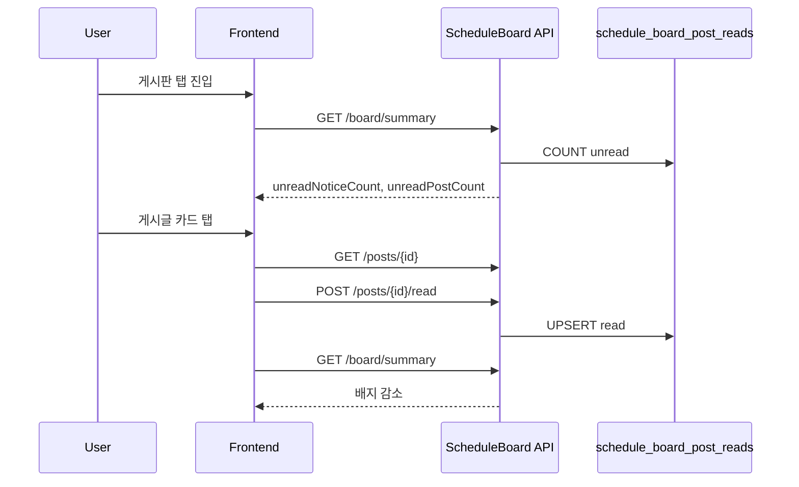

# Phase 2 — 일정 현장 게시판 DB/API 스펙

> **상태:** 설계 확정안 (구현 전)  
> **작성 기준:** Phase 1 hotfix (`e2ca567`) 이후  
> **범위:** `schedule_id` 중심 협업 게시판 (place_id 확장 없음)

---

## 0. 설계 원칙 (확정)

| 항목 | 결정 |
|------|------|
| 게시판 주체 | **`schedule_id`** (일정 1건 = 게시판 1개) |
| place_id | **사용하지 않음** |
| 카테고리 UI | 공지 · 질문 · **작업일지** · 작업사진 |
| API wire 값 | `notice`, `question`, `worklog`, `photo` |
| 저장소 | 관계형 테이블 (JSON blob 폐기) |
| 알림 push | **공지 · 내 글 댓글 · @멘션** 3종만 |
| 일반 글 알림 | push 없음 → **배지**(새 글 N / 미확인 공지 N) |

### Phase 1 → Phase 2 차이

| Phase 1 (현재) | Phase 2 (목표) |
|----------------|----------------|
| `user_site_board_data.payload_json` (유저별) | `schedule_board_*` (일정별 공유) |
| 참여자 간 글 공유 불완전 | 모든 참여자 동일 목록 |
| 읽음/배지 없음 | `schedule_board_post_reads` + summary API |

---

## 1. DB 스키마

### 1.1 ER 개요

```mermaid
erDiagram
  schedules ||--o{ schedule_board_posts : has
  schedule_board_posts ||--o{ schedule_board_comments : has
  schedule_board_posts ||--o{ schedule_board_post_images : has
  schedule_board_posts ||--o{ schedule_board_mentions : "mentions in post"
  schedule_board_comments ||--o{ schedule_board_mentions : "mentions in comment"
  schedule_board_posts ||--o{ schedule_board_post_reads : "read by user"
  users ||--o{ schedule_board_posts : writes
  users ||--o{ schedule_board_comments : writes
  users ||--o{ schedule_board_post_reads : reads

  schedule_board_posts {
    bigint id PK
    varchar schedule_id UK_part
    bigint author_user_id
    enum post_type
    varchar body
    datetime created_at
    datetime updated_at
  }

  schedule_board_post_reads {
    bigint id PK
    bigint user_id UK_part
    bigint post_id UK_part
    datetime read_at
  }
```

> **Note:** `schedules`는 Phase 2에서 MySQL 정규 테이블이 없을 수 있음.  
> `schedule_id`는 **`user_schedules_data.payload_json` 내 일정 ID 문자열**과 1:1 매핑하는 **논리 FK**로 사용.  
> 향후 `schedules` 테이블 도입 시 동일 `schedule_id` 유지.

---

### 1.2 `schedule_board_posts`

일정 게시판의 게시글.

| 컬럼 | 타입 | NULL | 설명 |
|------|------|------|------|
| `id` | BIGINT | N | PK, AUTO_INCREMENT |
| `schedule_id` | VARCHAR(64) | N | 일정 ID (`sched-xxx`, `sched-share-xxx` 등) |
| `briefing_id` | VARCHAR(64) | Y | 레거시 호환·딥링크 (마이그레이션용, 신규는 schedule_id와 함께 저장) |
| `author_user_id` | BIGINT | N | 작성자 (users.id) |
| `author_name` | VARCHAR(80) | N | 작성 시점 표시명 스냅샷 |
| `author_image_url` | VARCHAR(512) | Y | 프로필 이미지 스냅샷 |
| `post_type` | VARCHAR(16) | N | `notice` \| `question` \| `worklog` \| `photo` |
| `body` | VARCHAR(2000) | N | 본문 (photo-only 허용 시 빈 문자열 가능) |
| `created_at` | DATETIME(6) | N | |
| `updated_at` | DATETIME(6) | N | 댓글·수정 시 갱신 |
| `deleted_at` | DATETIME(6) | Y | soft delete (선택, Phase 2 후반) |

**인덱스**

| 이름 | 컬럼 | 용도 |
|------|------|------|
| `idx_sbp_schedule_created` | `(schedule_id, created_at DESC)` | 목록 조회 |
| `idx_sbp_schedule_type_created` | `(schedule_id, post_type, created_at DESC)` | 공지 필터 |
| `idx_sbp_author` | `(author_user_id)` | 알림·내 글 조회 |

---

### 1.3 `schedule_board_post_images`

작업사진 N장 (Phase 2는 1장 MVP → 다중 확장).

| 컬럼 | 타입 | NULL | 설명 |
|------|------|------|------|
| `id` | BIGINT | N | PK |
| `post_id` | BIGINT | N | FK → schedule_board_posts.id |
| `image_url` | VARCHAR(2048) | N | CDN/object storage URL |
| `sort_order` | INT | N | 0-based |
| `created_at` | DATETIME(6) | N | |

**인덱스:** `idx_sbpi_post (post_id, sort_order)`

**MVP 대안:** `schedule_board_posts.image_url` 단일 컬럼만 두고 2차에서 분리 테이블 도입 가능.

---

### 1.4 `schedule_board_comments`

| 컬럼 | 타입 | NULL | 설명 |
|------|------|------|------|
| `id` | BIGINT | N | PK |
| `post_id` | BIGINT | N | FK → schedule_board_posts.id |
| `author_user_id` | BIGINT | N | |
| `author_name` | VARCHAR(80) | N | |
| `body` | VARCHAR(500) | N | |
| `created_at` | DATETIME(6) | N | |
| `updated_at` | DATETIME(6) | N | |

**인덱스:** `idx_sbc_post_created (post_id, created_at ASC)`

대댓글 없음 (flat).

---

### 1.5 `schedule_board_mentions`

@멘션 (본문·댓글 공통).

| 컬럼 | 타입 | NULL | 설명 |
|------|------|------|------|
| `id` | BIGINT | N | PK |
| `post_id` | BIGINT | Y | 게시글 본문 멘션 |
| `comment_id` | BIGINT | Y | 댓글 멘션 |
| `mentioned_user_id` | BIGINT | N | 수신자 |
| `mentioned_name` | VARCHAR(80) | N | 파싱 시점 표시명 |
| `created_at` | DATETIME(6) | N | |

**제약:** `post_id` XOR `comment_id` (둘 중 하나만 NOT NULL)

**인덱스:** `idx_sbm_mentioned (mentioned_user_id, created_at DESC)`

---

### 1.6 `schedule_board_post_reads` ★ (읽음 — 권장)

`schedule_board_reads` vs `schedule_board_post_reads` 검토 결과 **후자 채택**.

| 비교 | `schedule_board_reads` | `schedule_board_post_reads` (권장) |
|------|------------------------|-------------------------------------|
| 의미 | 모호 (게시판 전체?) | **게시글 단위** 읽음 명확 |
| 알림 딥링크 | post_id 없으면 불가 | `post_id`로 **특정 글 이동 후 읽음 처리** |
| 배지 계산 | post join 필요 | post join 동일, 의도 명확 |
| 알림센터 연동 | 약함 | **강함** |

| 컬럼 | 타입 | NULL | 설명 |
|------|------|------|------|
| `id` | BIGINT | N | PK |
| `user_id` | BIGINT | N | 읽은 사용자 |
| `post_id` | BIGINT | N | FK → schedule_board_posts.id |
| `read_at` | DATETIME(6) | N | 읽음 시각 |

**UNIQUE:** `uk_sbpr_user_post (user_id, post_id)`

**인덱스**

| 이름 | 컬럼 | 용도 |
|------|------|------|
| `idx_sbpr_user` | `(user_id, read_at DESC)` | 내 읽음 이력 |
| `idx_sbpr_post` | `(post_id)` | post 삭제 cascade |

---

### 1.7 (선택) `schedule_board_user_cursors`

게시판 탭 **일괄 "모두 읽음"** 또는 목록 스크롤 watermark용. Phase 2 후반.

| 컬럼 | 타입 | 설명 |
|------|------|------|
| `user_id` | BIGINT | |
| `schedule_id` | VARCHAR(64) | |
| `last_seen_at` | DATETIME(6) | 마지막 게시판 방문 |
| `updated_at` | DATETIME(6) | |

**UNIQUE:** `(user_id, schedule_id)`

> post-level reads가 기본. cursor는 **보조**(「모두 읽음」 일괄 처리 시 bulk insert reads).

---

### 1.8 배지 계산 정의

#### 미확인 공지 N (`unread_notice_count`)

```
COUNT(*)
FROM schedule_board_posts p
WHERE p.schedule_id = :scheduleId
  AND p.post_type = 'notice'
  AND p.deleted_at IS NULL
  AND p.author_user_id != :viewerUserId          -- 본인 작성 제외
  AND NOT EXISTS (
    SELECT 1 FROM schedule_board_post_reads r
    WHERE r.user_id = :viewerUserId AND r.post_id = p.id
  )
```

#### 새 글 N (`unread_post_count`)

일반 카테고리(질문·작업일지·작업사진) — **push 없음, 배지만**.

```
COUNT(*)
FROM schedule_board_posts p
WHERE p.schedule_id = :scheduleId
  AND p.post_type IN ('question', 'worklog', 'photo')
  AND p.deleted_at IS NULL
  AND p.author_user_id != :viewerUserId
  AND NOT EXISTS (
    SELECT 1 FROM schedule_board_post_reads r
    WHERE r.user_id = :viewerUserId AND r.post_id = p.id
  )
```

#### 게시판 탭 UI 표시

| 위치 | 표시 |
|------|------|
| 일정 상세 「현장게시판」탭 | `미확인 공지 2` / `새 글 5` (또는 합산 배지) |
| 게시판 목록 헤더 | 동일 summary |
| 앱 전역 알림 bell | push 3종만; 배지는 **일정 탭 또는 게시판 진입 유도** |

#### 읽음 처리 트리거

| 이벤트 | 동작 |
|--------|------|
| 게시글 상세 시트 열기 | `POST .../posts/{postId}/read` |
| 게시판 탭 진입 + 목록 scroll (optional) | viewport 내 글 batch read |
| 「모두 읽음」 버튼 | `POST .../board/read-all` |
| 본인 게시글 작성 | **자동 read** insert (배지 0) |

---

## 2. API 명세

**Base URL:** `/api/schedules/{scheduleId}/board`  
**인증:** Kakao OAuth 세션 쿠키 (기존 `/api/users/me/*`와 동일)

### 2.1 공통

#### 참여자 검증 (모든 API)

```
canAccessScheduleBoard(userId, scheduleId):
  1. user_schedules_data.payload_json 에서 scheduleId 일정 존재
  2. AND (
       schedule.createdByUserId == userId
       OR schedule.acceptedParticipantUserId == userId
       OR schedule.scheduleInvites[].userId == userId
         AND status IN (accepted, confirmed)  → write
         OR status == pending                 → read only
     )
```

| 역할 | read | write |
|------|------|-------|
| owner (`createdByUserId`) | ✅ | ✅ (공지 포함) |
| accepted invitee | ✅ | ✅ (공지 **제외**) |
| pending invitee | ✅ | ❌ |
| non-participant | ❌ 403 | ❌ 403 |

---

### 2.2 Summary · 읽음

| Method | Path | 설명 |
|--------|------|------|
| GET | `/summary` | 배지용 미읽음 집계 |
| POST | `/posts/{postId}/read` | 단일 글 읽음 |
| POST | `/read-all` | 해당 schedule 전체 읽음 (optional) |

**GET `/summary` Response 200**

```json
{
  "scheduleId": "sched-share-1719000000",
  "unreadNoticeCount": 2,
  "unreadPostCount": 5,
  "unreadTotalCount": 7,
  "lastPostAt": "2026-06-21T14:30:00Z"
}
```

**POST `/posts/{postId}/read` Response 200**

```json
{
  "postId": 42,
  "readAt": "2026-06-21T15:00:00Z"
}
```

---

### 2.3 게시글

| Method | Path | 설명 |
|--------|------|------|
| GET | `/posts` | 목록 (필터·페이지) |
| GET | `/posts/{postId}` | 상세 + 댓글 + images |
| POST | `/posts` | 작성 |
| PATCH | `/posts/{postId}` | 수정 (작성자·owner) |
| DELETE | `/posts/{postId}` | 삭제 (soft, 작성자·owner) |

**GET `/posts` Query**

| param | type | 설명 |
|-------|------|------|
| `type` | string | `notice` \| `question` \| `worklog` \| `photo` \| `all` |
| `cursor` | string | `{createdAt}_{id}` 커서 |
| `limit` | int | default 20, max 50 |

**GET `/posts` Response 200**

```json
{
  "items": [
    {
      "id": 42,
      "scheduleId": "sched-share-1719000000",
      "postType": "notice",
      "body": "공동현관 비밀번호 변경",
      "authorUserId": 1,
      "authorName": "전경섭",
      "authorImageUrl": "",
      "imageUrls": [],
      "commentCount": 2,
      "isRead": false,
      "createdAt": "2026-06-21T10:00:00Z",
      "updatedAt": "2026-06-21T10:00:00Z"
    }
  ],
  "nextCursor": null
}
```

**POST `/posts` Request**

```json
{
  "postType": "worklog",
  "body": "3층 필름 시공 완료",
  "imageUrls": ["https://cdn.example/a.jpg"],
  "mentions": [{ "userId": 7, "name": "김철수" }]
}
```

**POST `/posts` Response 201** — 동일 shape + `id`

**에러 Response (공통 envelope)**

| HTTP | message |
|------|---------|
| 401 | 로그인이 필요합니다 |
| 403 | 이 일정에 접근 권한이 없습니다 |
| 403 | 초대 수락 후 글을 작성할 수 있습니다 |
| 403 | 공지는 현장 소장만 작성할 수 있습니다 |
| 404 | 일정을 찾을 수 없습니다 |
| 404 | 게시글을 찾을 수 없습니다 |
| 400 | 내용을 입력해 주세요 |
| 400 | 이미지 용량이 너무 큽니다 |
| 500 | 저장 중 오류가 발생했습니다 |

---

### 2.4 댓글

| Method | Path | 설명 |
|--------|------|------|
| GET | `/posts/{postId}/comments` | 댓글 목록 |
| POST | `/posts/{postId}/comments` | 댓글 작성 |

**POST `/posts/{postId}/comments` Request**

```json
{
  "body": "확인했습니다",
  "mentions": []
}
```

---

### 2.5 이미지 업로드 (2단계)

| Method | Path | 설명 |
|--------|------|------|
| POST | `/images/upload-url` | presigned URL 발급 |

Phase 2 MVP: base64 → 서버 저장 후 URL 반환 (Phase 1과 동일 한도 200KB)  
Phase 2.1: S3/R2 presigned.

---

### 2.6 레거시 API 폐기 계획

| API | 처리 |
|-----|------|
| `GET/PUT /api/users/me/site-boards` | deprecated → 410 또는 proxy 마이그레이션 |
| `POST .../site-boards/{briefingId}/posts` | 위 schedule board API로 대체 |

---

## 3. 권한 정책

### 3.1 post_type별 작성 권한

| post_type | UI | owner | accepted | pending |
|-----------|-----|-------|----------|---------|
| `notice` | 공지 | ✅ | ❌ | ❌ |
| `question` | 질문 | ✅ | ✅ | ❌ |
| `worklog` | 작업일지 | ✅ | ✅ | ❌ |
| `photo` | 작업사진 | ✅ | ✅ | ❌ |

서버: `post_type = notice` && `author != owner` → **403**

### 3.2 댓글

| 역할 | 읽기 | 작성 |
|------|------|------|
| owner / accepted | ✅ | ✅ |
| pending | ✅ | ❌ |

### 3.3 수정·삭제

- **수정:** 작성자 또는 owner
- **삭제:** 작성자 또는 owner (soft delete)
- **공지 고정(pin):** Phase 3 (optional)

---

## 4. 읽음 처리 구조

### 4.1 데이터 흐름



### 4.2 프론트 상태

| Store | 역할 |
|-------|------|
| `useScheduleBoardStore` (개편) | scheduleId keyed posts, summary |
| 일정 상세 탭 badge | `summary.unreadNoticeCount`, `summary.unreadPostCount` |
| 알림 push | summary와 **독립** (push 3종만) |

### 4.3 「모두 읽음」

```sql
INSERT INTO schedule_board_post_reads (user_id, post_id, read_at)
SELECT :userId, p.id, NOW()
FROM schedule_board_posts p
WHERE p.schedule_id = :scheduleId
  AND p.deleted_at IS NULL
  AND NOT EXISTS (SELECT 1 FROM schedule_board_post_reads r
                  WHERE r.user_id = :userId AND r.post_id = p.id)
ON DUPLICATE KEY UPDATE read_at = VALUES(read_at);
```

---

## 5. 알림 연동 구조

### 5.1 push 생성 (3종만)

| event_type | 트리거 | 수신자 | target |
|------------|--------|--------|--------|
| `BOARD_NOTICE` | `post_type=notice` INSERT | schedule 참여자 − 작성자 | `{ scheduleId, postId }` |
| `BOARD_COMMENT_ON_MY_POST` | comment INSERT | `post.author_user_id` | `{ scheduleId, postId, commentId }` |
| `BOARD_MENTION` | mention INSERT | `mentioned_user_id` | `{ scheduleId, postId?, commentId? }` |

### 5.2 push **미생성**

| 이벤트 |
|--------|
| question / worklog / photo 작성 |
| 타인 글 일반 댓글 (멘션 없음) |
| 읽음 처리 |

### 5.3 알림 클릭

```
/schedule/field/{scheduleId}?boardPost={postId}
→ 게시판 탭 active
→ 상세 시트 open
→ POST /read
```

### 5.4 notifications 테이블 (Phase 2.1)

Phase 2 MVP: 기존 `useNotificationStore` + 서버 `user_notifications` JSON 또는 신규 `notifications` 테이블.

**권장 `notifications` (향후)**

| 컬럼 | 설명 |
|------|------|
| `id` | |
| `recipient_user_id` | |
| `event_type` | BOARD_* |
| `payload_json` | scheduleId, postId, … |
| `read_at` | |
| `created_at` | |

게시판 **배지**(`schedule_board_post_reads`)와 **알림센터**(`notifications`)는 **별도 저장**.

---

## 6. 마이그레이션 전략

### 6.1 데이터 소스

| 소스 | 대상 |
|------|------|
| `user_site_board_data.payload_json` | `schedule_board_*` |
| `ildangmap_briefing_posts_v1` (잔존 localStorage) | 로그인 bootstrap 1회 |
| Phase 1 서버 JSON per user | schedule_id 매핑 후 merge |

### 6.2 briefingId → scheduleId 매핑

```
1. user_schedules_data.payload_json.schedules[] 순회
2. 각 schedule.briefingId → schedule.id 맵 구축
3. JSON posts의 briefingId 키로 schedule_id 결정
4. 매핑 실패 시 briefing-sched-{id} heuristic
5. 중복 post.id 충돌 시 새 UUID id 발급
```

### 6.3 마이그레이션 단계

| Step | 작업 |
|------|------|
| M1 | DDL 적용 (Hibernate ddl-auto 또는 Flyway) |
| M2 | 백엔드 dual-write 없이 **read new → fallback old** (feature flag) |
| M3 | one-shot migration job: JSON → relational |
| M4 | 프론트 API switch (`scheduleId` base) |
| M5 | `user_site_board_data` read-only 2주 → deprecated |
| M6 | JSON 테이블 archive / delete |

### 6.4 롤백

- feature flag `SCHEDULE_BOARD_V2=false` → Phase 1 `site-boards` API 복귀
- relational 데이터는 유지 (재전환 가능)

---

## 7. 예상 개발 일정

| Phase | 작업 | 기간 | 산출물 |
|-------|------|------|--------|
| **2A** | DDL + Entity + Repository | 2일 | 5~6 테이블 |
| **2B** | Posts/Comments CRUD API + 권한 | 2~3일 | REST + 테스트 |
| **2C** | post_reads + summary API + read-all | 1~2일 | 배지 계산 |
| **2D** | Mentions 파싱 + 알림 3종 | 1~2일 | notification emit |
| **2E** | 마이그레이션 job + JSON 이전 | 1일 | one-shot script |
| **2F** | 프론트 API 전환 + UI 배지 | 2~3일 | FieldScheduleNoticeBoard v2 |
| **2G** | QA (mobile/PC 동일 계정) + deploy | 1일 | prod |

**합계: 10~14 영업일** (1인 풀타임 기준)

### 권장 구현 순서

```
2A → 2B → 2C → 2F(목록·쓰기) → 2E → 2D → 2G
         ↑                          ↑
    API 먼저                   마이그레이션은 API 안정 후
```

### MVP 절단 (일정 단축 시)

| 포함 | 제외 (후속) |
|------|-------------|
| posts, comments, post_reads, summary | mentions (수동 @ 없이 2D 후반) |
| notice/question/worklog/photo | image presigned (base64 MVP) |
| 권한·배지 | soft delete, read-all |
| JSON 마이그레이션 | user_site_board_data 삭제 |

**MVP: 7~9 영업일**

---

## 8. 부록

### 8.1 post_type enum (Java)

```java
public enum ScheduleBoardPostType {
    NOTICE,    // wire: notice  (구 general)
    QUESTION,  // wire: question
    WORKLOG,   // wire: worklog  (UI: 작업일지)
    PHOTO      // wire: photo
}
```

### 8.2 Job 브리핑과의 관계

| | Job (`job_briefing_posts`) | Schedule (`schedule_board_posts`) |
|---|---------------------------|-----------------------------------|
| 키 | job_id + room | **schedule_id** |
| Phase 2 | 유지 (별도) | **신규 구현** |
| 통합 | Phase 3+ 에 API surface 통일 검토 | |

### 8.3 Phase 1 hotfix와의 호환

- Phase 1: `briefingId` + `user_site_board_data`
- Phase 2 전환: 일정 상세에서 **`scheduleId` API** 호출로 switch
- `briefing_id` 컬럼은 마이그레이션·딥링크용으로만 유지

---

## 9. 검토 체크리스트 (구현 착수 전)

- [ ] `schedule_id` 논리 FK — schedules 정규 테이블 도입 시점 결정
- [ ] 이미지 storage (base64 MVP vs CDN) 결정
- [ ] `notifications` 테이블 Phase 2 포함 vs 2.1 연기
- [ ] MVP 절단 범위 (mentions/read-all) 확정
- [ ] 마이그레이션 dual-run 기간

---

**문서 버전:** 1.0  
**다음 단계:** 검토 후 Phase 2A (DDL) 착수 여부 결정
