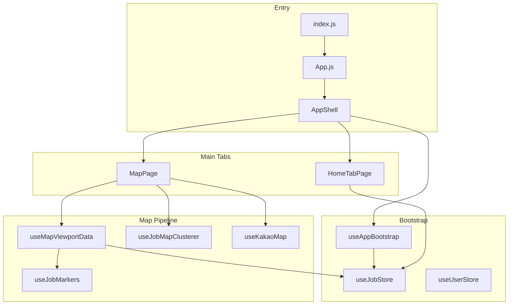

# 일당맵(ildangmap) — PROJECT_HANDOFF_FOR_CHATGPT

> **목적:** ChatGPT(또는 다른 AI/개발자)가 현재 프론트엔드 구조·상태·흐름을 한눈에 파악하고 이후 개발을 이어갈 수 있는 인수인계 문서.  
> **기준일:** 2026-05-20  
> **워크스페이스:** `ildangmap/frontend` (React CRA) + `ildangmap/backend` (Spring Boot)  
> **설명 원칙:** 코드 복붙보다 **구조·흐름·책임** 중심.

---

## 1. 프로젝트 개요

### 서비스 목적

**일당맵**은 인테리어·현장 노동(필름, 타일, 도배, 전기 등)의 **일당·단기 헬프·견적 요청**을 **지도 + 피드**로 탐색하고, 오야지(현장)와 기술자(노동자)가 빠르게 매칭하는 **모바일 우선 현장 노동 마켓플레이스** MVP다.

### 핵심 사용자

| 페르소나 | 역할 |
|----------|------|
| **기술자** | 근처 현장 탐색, 지원, 일정·연락처 관리 |
| **오야지** | 공고 등록, 지원자 승인, 현장 브리핑·정산 |
| **소비자** | 방문 견적·시공 요청 (estimate flow) |

`useUserStore.profile.shellPersona` / `userType`으로 UX 분기(탭 배지, 권한 문구).

### MVP 목표

1. **홈 피드**에서 현장을 스캔하고 **1~2탭으로 지원** (당근형 compact list).
2. **지도**에서 근처 공고·견적을 **공간적으로 탐색** (거지맵형 말풍선 마커).
3. **날짜·지역·검색 필터**로 “오늘/근처” 현장 노출.
4. **견적 4단계** (`quote_open` → `visiting` → `closed`) 지도·피드 반영.
5. Mock-first로 **UI·플로우 완성** 후 Spring API 점진 연동.

### 핵심 UX 철학

- **홈 = 메인(행동):** 지원·상세·찜은 홈에서.
- **지도 = 탐색(공간):** 마커 하이라이트, “홈에서 지원하기” 유도.
- **비강제 로그인:** 둘러보기 가능, 지원·등록 시 `LoginPromptSheet`.
- **고령층 친화:** 큰 터치 영역, 짧은 문장, pill CTA, Pretendard, 낮은 정보 밀도(홈 compact).
- **거지맵 + 당근 혼합:** 지도 풀스크린 + 말풍선 마커 / 피드는 당근형 리스트·오렌지 포인트.

---

## 2. 현재 구현 기능

### 지도 기능

| 기능 | 상태 | 구현 위치 |
|------|------|-----------|
| Kakao Map 초기화 | ✅ | `useKakaoMap`, `public/index.html` SDK |
| 공고 CustomOverlay 마커 | ✅ | `useJobMarkers` + `jobSpeechBubbleOverlay.js` |
| 견적 집형 마커 | ✅ | `useEstimateMarkers` + `estimateSpeechBubbleOverlay.js` |
| 줌 level≥8 클러스터 | ✅ | `useJobMapClusterer` (overlay와 배타) |
| 뷰포트 bounds 클리핑 | ✅ | `useMapViewportData` → `jobsInBounds` |
| 날짜 필터 (strict `workDate`) | ✅ | `filters.selectedDateKey`, 날짜 변경 시 **center 이동 없음** |
| 검색·craft/trade/work/distance 필터 | ✅ | `useJobStore.filters` + `MapFilterSheet` |
| 마커 클릭 선택 하이라이트 | ✅ | `selectedJobId`, pan/상세 없음 |
| 견적: 날짜 무관, closed 숨김 | ✅ | `estimateRequestModel` |
| 목록 FAB/팝업/지원 시트 | 🗄️ 제거됨 | `MapJobListPopup` 등 코드 잔존 |
| MapGeoDock + BottomSheet 목록 | 🗄️ 미연결 | `MapGeoDock.jsx`, `useGeoDockSheet.js` |

### 공고 기능

| 기능 | 상태 |
|------|------|
| 목록/피드 | ✅ 홈 `buildHomeFeedItems`, 지도 viewport pipeline |
| 상세 | ✅ `HomeJobDetailSheet` (홈), 레거시 `/jobs/:id` |
| 지원 (한 줄 메모) | ✅ `JobApplyQuickSheet` + `applyToJob` |
| 등록 | ✅ `JobPostComposerModal` + `createJobPost` |
| 찜 | ✅ `toggleJobBookmark` |
| 지원자 승인/거절 | ✅ `ApplicantsSheet` (오야지) |
| 긴급헬프·팀원구함 | ✅ `jobModel` + 홈 필터칩 |

### 상태관리

- **Zustand** 8개 store + **Context는 store 브리지** (Provider 트리 거의 없음, `index.js`는 `<App />`만).
- **Bootstrap:** `AppShell` → `useAppBootstrap` (jobs, user, settlement 1회).

### BottomSheet

| 계층 | 역할 |
|------|------|
| `BottomSheet.jsx` | 범용 vh 드래그 시트 (거지맵형) |
| `useMapSheetController` | MapPage 전용 reducer + `useUiStore.activeBottomSheet` 동기화 |
| `useGeoDockSheet` | dock 스냅 (MapGeoDock용, 현재 MapPage 미사용) |
| 홈 | `HomeJobDetailSheet` = fixed fullscreen (BottomSheet 아님) |

### 로그인 상태

```
useUserStore (persist)
  → session.isAuthenticated, authReady
  → useAuth() / useUserProfile() (Context 브리지)
  → LoginPromptSheet (useUiStore.authPromptOpen)
  → mock: loginWithKakaoMock / live: startKakaoOAuthLogin → /oauth/kakao/callback
```

- **비로그인:** 피드·지도 열람 가능.
- **지원/등록:** `openAuthPrompt(reason)` — `apply`, `post`, `consumer` 등.

### API 연결 상태

- **개발 기본:** Mock ON (`REACT_APP_USE_MOCK_API !== "false"`).
- **프로덕션 빌드 기본:** Mock OFF (`REACT_APP_USE_MOCK_API=true`로만 켬).
- **Live:** `REACT_APP_API_BASE_URL` + session cookie (`ILDANGMAPSESSION`).
- **Reachability:** `apiReachability.js` — 백엔드 다운 시 live 스킵.

### mock/real 분리 상태

```
UI / Page
  → useJobStore action
    → api/*.js (runApiRequest)
      → isMockApiEnabled() ?
           true  → mock fn + localStorage/seed
           false → fetch(API_BASE_URL) → onSuccess 후 refreshJobs()
```

| 레이어 | Mock 데이터 소스 |
|--------|------------------|
| Jobs | `initialJobsSeed` + `jobsStorage` + `ildangmap_job_store_v2` |
| Consumer requests | `consumerRequestsStorage` + store.requests |
| User | `userApi` mock + `useUserStore` persist |
| Schedule/Settlement | `scheduleModel`, store mock refresh |

---

## 3. 전체 폴더 구조 (`src/` 기준)

```
src/
├── api/                 # HTTP + mock 분기, contract 매핑
├── components/
│   ├── layout/          # AppShell
│   ├── navigation/      # MainTabBar (5탭)
│   ├── home/            # 메인 피드 UI (신규 핵심)
│   ├── map/             # 지도 chrome, composer, 레거시 list/popup
│   ├── Jobs/            # 레거시 JobList, JobDetail
│   ├── BottomSheet/     # 범용 시트
│   ├── field/           # 현장 메모, 브리핑, 참여자
│   ├── schedule/        # 일정 탭
│   ├── contacts/        # 연락처
│   ├── notifications/   # 알림 센터
│   ├── auth/            # 로그인·페르소나 시트
│   └── ui/              # AppToast 등
├── constants/           # quoteStatus, homeFeedFilter, authStorage
├── context/             # Zustand 브리지 (fetch 없음)
├── hooks/               # 지도·시트·bootstrap·마커
├── overlays/            # Kakao HTML 템플릿 (React 밖)
├── pages/               # 라우트 페이지
├── store/               # Zustand stores
├── styles/              # geo-map-*, home-feed, daangn-shell
├── utils/               # jobModel, storage, feed/map models
├── mocks/               # mock shape helpers
└── data/                # 정적 데이터 일부
```

### 폴더별 역할

| 폴더 | 역할 |
|------|------|
| `api/` | `client.js` 중심 mock/live; `jobApi`, `applicationsApi`, `userApi`, `scheduleApi`… |
| `components/home/` | **메인 UX** — 피드 카드, 상세 시트, 필터칩 |
| `components/map/` | 지도 상단바, 날짜바, 검색/필터, composer, **레거시** list/popup/dock |
| `hooks/` | MapPage 오케스트레이션 분리본, Kakao lifecycle |
| `overlays/` | 마커 HTML 문자열 생성 (imperative) |
| `pages/` | 탭 페이지 + 깊은 라우트 (`/jobs/:id`, briefing room) |
| `store/` | 전역 상태·persist |
| `utils/jobModel.js` | 도메인+UI 파생 **God module** (~1100+ lines) |

---

## 4. 핵심 엔트리 및 주요 파일 설명

### 엔트리 체인

```
index.js
  → App.js (BrowserRouter, Routes)
    → AppShell (Outlet + MainTabBar + global sheets)
      → HomeTabPage | MapPage | ScheduleTabPage | …
```

**Provider 트리 없음:** `AuthProvider` 등은 `children`만 반환. 실제 상태는 **Zustand 직접 구독**.

---

### `MapPage.js` (~690 lines)

| 항목 | 내용 |
|------|------|
| **역할** | 지도 탭 오케스트레이터: Kakao, viewport pipeline, 마커/클러스터, 검색·필터·composer |
| **현재 책임** | `useMapViewportData` → `useJobMarkers` / `useEstimateMarkers` / `useJobMapClusterer`; MapTopBar·DateBar·FloatingChrome; 글쓰기·지원자 시트 |
| **Import 핵심** | `useKakaoMap`, `useMapViewportData`, `useMapChromeData`, `useMapPageIntentFlows`, `useMapSheetController`, `useMapPageMapEffects`, `useJobStore`, `useUiStore` |
| **문제점** | God component; dead state (`jobListOpen`, `applyQuickJob`, `detailEstimate`); sheet↔UI 불일치 |
| **리팩토링** | **필수** — `MapDiscoveryPage` + hooks 묶음, dead code 삭제 |

---

### `AppShell.jsx`

| 항목 | 내용 |
|------|------|
| **역할** | 앱 셸: `useAppBootstrap`, 하단 탭, 전역 시트/토스트/온보딩 |
| **현재 책임** | OAuth `?login=success` 처리, 채팅/알림 상세 시 하단 탭 숨김 |
| **문제점** | 전역 관심사 증가 가능 |
| **리팩토링** | **낮음** — 유지, bootstrap만 분리 가능 |

---

### Stores (`src/store/`)

| Store | 역할 | 리팩토링 |
|-------|------|----------|
| `useJobStore` | jobs, requests, filters, selection, CRUD/apply | **중** — requests 분리, filter 통합 |
| `useUserStore` | session, profile, auth | **중** — mock/live 경계 문서화 |
| `useUiStore` | tab, bottomSheet, toast, mapZoomFar, authPrompt | **중** — bottomSheet 키 정리 |
| `useFieldScheduleStore` | 일정 | 낮음 |
| `useSettlementStore` | 정산·브리핑 | 낮음 |
| `useChatStore` | 채팅방 mock | 중 |
| `useContactsStore` | 연락처 | 낮음 |
| `useWorkTimelineStore` | 타임라인 | 낮음 |
| `useFieldScheduleChangeStore` | 일정 변경 요청 | 낮음 |

---

### Hooks (지도·핵심)

| Hook | 역할 | 리팩토링 |
|------|------|----------|
| `useKakaoMap` | SDK poll → Map 인스턴스 | 낮음 |
| `useMapViewportData` | 필터 파이프라인 → bounds clip | **유지** (핵심) |
| `useJobMarkers` | CustomOverlay diff | **높음** — signature/content 갱신 |
| `useEstimateMarkers` | 견적 overlay | 높음 |
| `useJobMapClusterer` | MarkerClusterer | 낮음 |
| `useMapSheetController` | reducer + uiStore sync | **중** — dead keys |
| `useMapSelectionActions` | 마커 클릭 → selectedJobId only | 낮음 |
| `useMapPageIntentFlows` | 검색·composer·location handlers | **중** — MapPage에서 분리 |
| `useAppBootstrap` | 앱 최초 데이터 로드 | 낮음 |

---

### Overlays

| 파일 | 역할 |
|------|------|
| `jobSpeechBubbleOverlay.js` | 공고 말풍선 HTML (pay, urgent, craft tone) |
| `estimateSpeechBubbleOverlay.js` | 견적 집 마커 HTML |

**문제:** React 렌더 트리 밖; `buildJobsOverlaySignature`는 **id만** 비교 → 필드 변경 시 stale HTML.

---

### API

| 파일 | 역할 | 리팩토링 |
|------|------|----------|
| `client.js` | `runApiRequest`, mock switch, errors | 유지 |
| `jobApi.js` | GET/POST jobs, mock→localStorage | **중** — live contract 검증 |
| `applicationsApi.js` | 지원/승인/거절 | 중 |
| `contracts/jobContracts.js` | API ↔ frontend job shape | **필수** (Spring 연동 시) |
| `apiReachability.js` | backend up/down | 유지 |

---

### BottomSheet

| 파일 | 역할 |
|------|------|
| `BottomSheet.jsx` | vh 드래그, snap points, `onHeightVhChange` |
| `useGeoDockSheet.js` | dock + spring (MapGeoDock) |
| `useMapSheetController` | MapPage sheet state → `useUiStore.openBottomSheet` |

**현재 MapPage는 BottomSheet 목록 UI를 렌더하지 않음** — reducer/uiStore 동기화만 잔존.

---

### Map components (대표)

| 컴포넌트 | 역할 | 상태 |
|----------|------|------|
| `MapTopBar` / `MapStatusBar` / `MapDateScrollBar` | 상단 chrome | ✅ 사용 |
| `MapFloatingChrome` | 검색·필터 패널 호스트 | ✅ |
| `MapFilterSheet` / `MapSearchPanel` | 필터 UX | ✅ |
| `JobPostComposerModal` | 공고 등록 | ✅ |
| `ApplicantsSheet` | 지원자 관리 | ✅ |
| `MapJobListPopup` / `FieldJobListCard` | 목록 | 🗄️ |
| `MapGeoDock` | dock+sheet | 🗄️ |
| `JobDetailModal` | 지도 상세 | 🗄️ |
| `EstimateRequestDetailSheet` | 견적 상세 | 🗄️ (MapPage 미연결) |

---

### `HomeTabPage.jsx` (~204 lines)

| 항목 | 내용 |
|------|------|
| **역할** | **메인 탭** — compact 피드, 필터, 상세·지원 |
| **데이터** | `buildHomeFeedItems` + `useJobs` + `useConsumerRequests` |
| **문제점** | 지도와 필터·상세 이원화 |
| **리팩토링** | **중** — shared feed card/detail |

---

## 5. 상태관리 구조

### Zustand store 목록

```
useJobStore      → jobs, requests, filters, selectedJobId, mutations
useUserStore     → session, profile, prefs(일부), auth
useUiStore       → tab, sheets, toast, mapZoomFar, notifications UI
useFieldScheduleStore
useSettlementStore
useChatStore
useContactsStore
useWorkTimelineStore
useFieldScheduleChangeStore
```

### Context = Selector 브리지

```
useJobs()           → useJobStore.jobs
useAuth()           → useUserStore.session
useConsumerRequests() → useJobStore.requests (또는 storage bridge)
useUserMapPreferences() → localStorage + setPrefs
```

**패턴:** 페이지는 Context hook 사용 가능, 내부는 Zustand.

### 상태 흐름 (지도 선택 예)

```
마커 click
  → useMapSelectionActions.handleMarkerClick
  → useJobStore.setSelectedJobId (toggle)
  → useJobMarkers effect → CSS selected + zIndex

지도 blank click (220ms debounce)
  → useKakaoMapSelectionReset
  → selectedJobId null, detailJobId null (reducer)
```

### Selector 구조

- Zustand: `useJobStore((s) => s.filters.selectedDateKey)` — 필드별 구독.
- **위험:** MapPage에서 store selector 15개+ — rerender 넓음.

### 중복 상태

| 상태 A | 상태 B | 문제 |
|--------|--------|------|
| `selectedJobId` (store) | `detailJob` (HomeTabPage local) | 선택 이원화 |
| `detailJobId` (mapSheetReducer) | `activeBottomSheet` (uiStore) | UI 제거 후 유령 동기화 |
| `selectedCardId` (uiStore) | `selectedJobId` | 카드/마커 이중 |
| `feedFilter` (홈 local) | `filters.*` (지도 store) | 필터 개념 중복 |
| `jobs` (store persist) | `jobsStorage` (localStorage) | 이중 저장 |

---

## 6. 데이터 흐름

### 공고 생성 → 지도 렌더링

```
[UI] JobPostComposerModal.onSubmit
  → useMapPageIntentFlows.handleCreateJob
    → useJobStore.createJobPost(payload)
      → jobApi.createJob (runApiRequest)
        → mock: saveStoredJobs + mergeJobsWithSeedData
        → live: POST /jobs → refreshJobs()
      → store.jobs 갱신
        → syncLegacyJobState → localStorage

[UI] MapPage / useJobs()
  → jobs (Zustand)

[Pipeline] useMapViewportData({ jobs, filters, mapBounds, requests })
  → activeJobs (만료 제외)
  → filteredJobs (selectedDateKey strict)
  → jobsForMap (검색·region·board)
  → jobsInBounds (viewport clip)

[Render] jobsInBoundsSignature
  → useJobMarkers({ jobs, jobsSignature, selectedJobId })
    → getJobSpeechBubbleHtml(job) → CustomOverlay on map

[Parallel] estimatesInBounds → useEstimateMarkers (날짜 무관)
```

### 지원 흐름 (홈 기준)

```
HomeFeedJobCard "지원"
  → JobApplyQuickSheet
  → applyToJob(id, { memo })
  → mock: mergeApplyResultIntoJob → jobs 갱신
  → HomeFeedJobCard deriveViewerJobState → 버튼 "지원완료"
```

---

## 7. 지도 시스템 구조

### KakaoMap 구조

```
public/index.html
  → dapi.kakao.com SDK (services, clusterer)
useKakaoMap(mapRef, { center, level })
  → window.kakao.maps.Map
MapCanvas (div ref)
```

### Marker 생성 방식

- **CustomOverlay** (말풍선 DOM), `clickable: false`.
- 클릭: `bindMarkerPointerTarget` on inner `.geo-*-marker`.
- **Cluster:** `kakao.maps.MarkerClusterer` — 일반 Marker 객체 (overlay와 별도).

### Overlay 생성 방식

```
useJobMarkers
  overlayMapRef: Map<jobId, { overlay, anchorEl, lat, lng }>
  jobsSignature 변경 시:
    - 신규 id → createOverlayEntry
    - 기존 id → lat/lng만 setPosition (HTML 유지)
    - 제거 id → setMap(null)
```

견적: `useEstimateMarkers` — signature에 status/display/supporters 포함 (공고보다 정교).

### Clustering 구조

```
useKakaoMapViewportSync
  → map.getLevel() >= 8 → useUiStore.mapZoomFar = true

zoomFar === true  → useJobMapClusterer enabled, useJobMarkers overlaysEnabled=false
zoomFar === false → overlays on, clusterer cleared
```

### selectedJob 흐름

- **저장:** `useJobStore.selectedJobId`
- **표시:** `useJobMarkers` CSS class + zIndex
- **해제:** 지도 click / 토글 재클릭 / 필터로 목록에서 사라지면 `useSelectedJobSheetSync`가 null 처리
- **상세 이동:** 현재 **없음** (홈으로 유도)

### 성능 이슈

1. `jobsSignature` id-only → 불필요한 stale 또는 불필요한 skip.
2. zoomFar 토글 시 overlay **전량 destroy/recreate**.
3. MapPage **다수 store selector** → 필터 변경 시 broad rerender.
4. `StrictMode` off (dev double-mount 방지) — 릴리스 전 재검토.
5. `liveBoundsSync: jobListOpen` — UI 제거 후에도 bounds effect 잔존 가능.

---

## 8. UI 구조

### Mobile 구조

```
daangn-shell (100dvh, overflow hidden)
  main.daangn-shell__main
    [탭 페이지 full height]
  geo-tabbar (5탭, safe-area)
```

- 지도: `map-tab-page--discover` — 상단 고정 chrome + 캔버스 + floating 검색/필터.
- 홈: `home-tab-page` — 스크롤 리스트 + fixed 상세 시트.

### Desktop 구조 (`min-width: 1024px`)

- `daangn-shell-desktop.css`: **좌측 세로 탭바** + 넓은 main.
- 지도 우측 패널 변수 (`--right-panel-w`) — **일부 레거시**; 현재 MapPage는 풀스크린 discover.

### BottomSheet orchestration

```
MapPage
  useMapSheetController
    mapSheetReducer (detailJobId, searchPanelOpen, …)
      useEffect → useUiStore.openBottomSheet(key, payload)
      useEffect → --map-sheet-vh CSS variable

BottomSheet.jsx (실제 드래그 UI) — MapGeoDock 등에서만 사용
```

**홈 상세는 BottomSheet 아님** — `position: fixed` fullscreen sheet.

### Modal orchestration

| 유형 | 예 |
|------|-----|
| Fullscreen sheet | `HomeJobDetailSheet`, `HomeEstimateDetailSheet` |
| Center modal | `JobPostComposerModal`, `MapFilterSheet` |
| `ApplicantsSheet` | 지도 하단 시트형 |
| Global | `LoginPromptSheet`, `NotificationCenterSheet`, `OnboardingGate` |

### FAB 구조

- 지도: **내 위치 FAB** (`MapFloatingChrome`), 글쓰기는 `MapWriteMenuSheet` (상태 `writeMenuOpen`).
- 레거시: `MapJobListToggleFab` (목록) — MapPage 미연결.

---

## 9. 현재 기술 부채 (상세)

### 비대한 컴포넌트·모듈

- `MapPage.js` ~690줄 — 검색·지도·composer·dead handlers.
- `jobModel.js` ~1100+줄 — migrate, status, marker tone, sort, viewer state 혼재.
- `initialJobsSeed.js` ~800+줄 — mock 데이터.

### Props drilling

- MapPage → `useMapPageIntentFlows`에 **40개+ 인자** 객체로 전달 (사실상 god hook).
- Context Provider 없어 drilling 대신 **hook mega-params**.

### Rerender 문제

- MapPage가 `useJobStore`에서 필터·액션 다수 구독.
- `jobs` 배열 참조 변경 시 viewport useMemo 재계산 → 마커 effect.
- 홈 `feedItems` useMemo — `jobs` 전체 의존.

### Overlay 문제

- Imperative DOM; React state와 **HTML 불일치** (id-only signature).
- `clickable: false` + pointer bridge — 디버깅 어려움.
- unmount cleanup은 있으나 **이벤트 리스너** 누수 엣지 가능.

### z-index 문제

- 마커 selected `zIndex: 40` vs 기본 `12`.
- Floating chrome, 시트, 토스트가 각 CSS 파일에 분산 — **전역 z-index scale** 없음.

### Duplicated state

- 선택: `selectedJobId` / `detailJob` / `detailJobId` / `selectedCardId`.
- 필터: 홈 `feedFilter` vs 지도 `filters.*`.
- Storage: zustand persist + `jobsStorage` + legacy keys.

### Mock 혼재 문제

- `isMockApiEnabled()` 분기가 store·api·LoginPrompt·Onboarding everywhere.
- mock apply는 즉시 jobs 패치, live는 refresh — **UI 타이밍 불일치**.
- `migrateJob`이 mock/live shape 차이 흡수 — Spring 전환 시 contract 필수.

### 기타 레거시

- `MapJobListPopup`, `MapGeoDock`, `JobDetailPage`, `components/Jobs/*`.
- `useMapSheetController` ↔ 제거된 UI 동기화.
- `jobsApi.js` vs `jobApi.js` — 이름 중복 주의.

---

## 10. 앞으로 우선순위 (코드 기준)

| 순위 | 작업 | 이유 |
|------|------|------|
| **P0** | MapPage dead code 제거 (`jobListOpen`, `applyQuickJob`, estimate detail state) | 혼란·버그 유발 |
| **P0** | 홈·지도 **선택/상세/지원 경로 문서화+단일화** (`JobFeedCard`, `JobDetailSurface`) | UX 분열 해소 |
| **P1** | `useJobMarkers` signature에 marker content key 추가 | stale 마커 |
| **P1** | `jobModel` domain / ui 분리 | 유지보수 |
| **P2** | MapPage → `useMapDiscovery*` hook 묶음 | God file 해소 |
| **P2** | `useJobStore.requests` → `useEstimateStore` | 도메인 분리 |
| **P3** | Spring live E2E (`smoke:*` + `REACT_APP_USE_MOCK_API=false`) | MVP 출시 |
| **P3** | z-index scale, global overlay layer doc | UI 버그 예방 |
| **P4** | MapGeoDock/MapJobListPopup 삭제 또는 archive | 레거시 |

---

## 11. 절대 유지해야 하는 UX 방향

1. **거지맵 스타일 지도** — 풀스크린, 말풍선 마커, 줌아웃 클러스터, 최소 텍스트 chrome.
2. **당근 스타일 홈** — compact feed, 큰 터치, 오렌지 포인트, 풀스크린 상세.
3. **지도 중심 탐색** — 공간적 발견은 지도; **행동(지원)은 홈** (현재 분리 유지).
4. **고령층 친화** — 짧은 라벨, pill CTA, 과밀 정보 금지, Pretendard.
5. **비강제 로그인** — `LoginPromptSheet`는 액션 시점만.
6. **단순한 공고 등록** — composer wizard, 주소·날짜·급여 최소 입력.
7. **날짜 필터 시 지도 center 고정** — UX 요구사항 (이동 금지).

---

## 12. 현재 실행 방법

### Frontend

```bash
cd frontend
npm install
npm start          # CRA dev server → http://localhost:3000
# package.json에 "npm run dev" 스크립트 없음 — start 사용
npm run build      # 프로덕션 빌드
```

**스모크 (Spring 연동 검증):**

```bash
npm run smoke:jobs
npm run smoke:apply-job
npm run smoke:create-job
```

### Backend

```bash
cd backend
# Windows
gradlew.bat bootRun
# macOS/Linux
./gradlew bootRun
```

- 기본 포트: **8080**
- DB: MySQL `ildangmap` ( `application.yml` — local root/1234 )
- OAuth: Kakao (`KAKAO_CLIENT_ID`, `KAKAO_CLIENT_SECRET` 환경변수)

### env 필요 여부

| 변수 | 용도 | 기본(개발) |
|------|------|------------|
| `REACT_APP_USE_MOCK_API` | mock on/off | **ON** (`!== "false"`) |
| `REACT_APP_API_BASE_URL` | Spring base | 빈 문자열(상대) 또는 `http://localhost:8080` |
| `REACT_APP_MOCK_DELAY_MS` | mock 지연 | 300 |

**권장:** `frontend/.env.development.local` (gitignore)

```env
REACT_APP_USE_MOCK_API=false
REACT_APP_API_BASE_URL=http://localhost:8080
```

**Kakao Map:** `public/index.html`에 appkey 하드코드 — 배포 시 키·도메인 제한 확인.

### 라우트 빠른 참조

| URL | 페이지 |
|-----|--------|
| `/` → `/home` | HomeTabPage |
| `/map` | MapPage |
| `/schedule` | ScheduleTabPage |
| `/contacts` | ContactsTabPage |
| `/settings` | MyTabPage |
| `/jobs/:id` | JobDetailPage (레거시) |

---

## 부록 A — 컴포넌트 관계 다이어그램



---

## 부록 B — ChatGPT에 추가 첨부 권장

1. 이 문서
2. 스크린샷: `/home`, `/map`, 필터, 마커 선택, 상세, 설정
3. 소스: `MapPage.js`, `HomeTabPage.jsx`, `useJobStore.js`, `useJobMarkers.js`, `useMapViewportData.js`, `jobApi.js`, `client.js`
4. (선택) `jobModel.js` export 목록 + `initialJobsSeed.js` 헤더

---

## 부록 C — 관련 문서

- `docs/FIELD_DATA_MODEL.md` — 현장 데이터 모델 참고

---

## 13. 제품 방향 (참고 UI 시안) — 오야지 현장 운영 OS

> 아래는 2026-05 참고 이미지(오야지 중심 현장 운영)를 **현재 코드베이스에 맞춘 UX 우선순위·구조 재정리**다.  
> 원칙: **구조는 유지**, **탭 역할·표현·데이터 노출 순서**만 조정.

### 13.1 비전 한 줄

**단순 구인앱 → 「오늘 현장을 운영하는 오야지용 도구」**  
실시간 흐름(누가·어디·몇 명·긴급 여부)을 **지도 + 오늘 일정** 두 축으로 보여 주고, ERP 없이 3탭 이내로 끝낸다.

### 13.2 시안 핵심 UX ↔ 현재 코드 매핑

| 시안 UX | 의미 | 이미 있는 코드 | 갭 (우선 보강) |
|---------|------|----------------|----------------|
| **긴급헬프** | 즉시 인원·단기 투입 | `isLiveHelpJob`, `MapWriteMenuSheet` help, 홈 필터 `HELP`, `promoteJobToUrgent` | 마커/카드에 **남은 시간·인원** 한 줄; 오야지 **SOS 발행** 1탭 |
| **오후합류** | 오후만 합류 가능 | `workType` afternoon, `ownerMemo` 목업 문구 | 필터칩 `오후가능` + `jobBoardFilter` 또는 홈 칩 **신규** |
| **팀배치** | N/M 인원·아바타 | `participants`, `getCurrentWorkingCount`, `ApplicantsSheet` | 카드/오버레이 **3/4** 표기; `FieldParticipantsPanel` 연결 |
| **현장정보 자동공유** | 주소·주차·도구 일괄 | `FieldShareSheet`, `preparationInfo`, `TodayFieldWorkPage` | 지원 확정 후 **자동 푸시** 1버튼 (mock inbox) |
| **일정 흐름** | 오늘·진행·예정·완료 | `ScheduleTabPage`, `useFieldScheduleStore`, `TodayFieldWorkPage` | **홈(오야지)** = 오늘 현장 리스트 헤더 (시안 좌측 폰) |
| **즐겨찾기 팀 초대** | 신뢰 팀원 일괄 초대 | `favoriteWorkers`, `FieldShareSheet` favorites 탭 | 홈/현장 상세 **「팀 초대」** CTA |
| **현장 기록** | 사진·출근·메모 | `FieldMemorySection`, briefing posts | MVP는 **메모+출근 로그**만; 사진은 P2 |

### 13.3 탭 역할 재정의 (코드 구조 유지)

현재 5탭(`MainTabBar`) **경로·store 변경 없음**. **콘텐츠·기본 진입만** 페르소나별로 다르게.

```
                    ┌─────────────────────────────────────┐
                    │           AppShell + bootstrap       │
                    └─────────────────────────────────────┘
                                      │
        ┌─────────────────────────────┼─────────────────────────────┐
        ▼                             ▼                             ▼
   [홈 /home]                    [지도 /map]                  [일정 /schedule]
   역할 = 행동·운영 허브          역할 = 공간·상태 허브          역할 = 날짜·흐름 허브
        │                             │                             │
   worker: compact 피드+지원    worker: 탐색+마커              worker: 내 일정·출근
   oyaji:  오늘 현장 운영 보드   oyaji:  현장 밀도 지도         oyaji:  다현장 캘린더
        │                             │                             │
   기존: HomeTabPage            기존: MapPage                  기존: ScheduleTabPage
   확장: userMode 분기          확장: 필터칩+오버레이 밀도      확장: 상태 탭(진행/예정)
   자산: OyajiHomePanel(미연결)  자산: MapStatusBar, markers   자산: briefing, today-field
```

| 탭 | 기술자 (worker) | 오야지 (oyaji) | 공통 store |
|----|-----------------|----------------|------------|
| **홈** | 지원·스캔 피드 (현행 유지) | **오늘 현장 N건** + 인원부족 + 긴급 + 「현장등록」 | `useJobStore`, `homeFeedModel` |
| **지도** | 근처 탐색 (현행) | 같은 지도 + **운영 밀도** (인원/긴급/오후 태그) | `useMapViewportData`, overlays |
| **일정** | 내 스케줄 | 다현장 **진행/예정/완료** | `useFieldScheduleStore` |
| 연락처 | 팀·즐겨찾기 | **빠른 초대** 소스 | `useContactsStore`, favorites |
| 설정 | 프로필 | 모드 전환 | `useUserStore.userMode` |

**`userMode` (`oyaji` | `worker`)** — 이미 `useUserStore` + `OnboardingGate` + `UserModeToggle`.  
**추가 라우트 없이** `HomeTabPage` / `MapPage` 상단에서 분기만 넣으면 시안의 「오야지 메인 / 기술자 메인」을 맞출 수 있음.

### 13.4 UX 우선순위 (코드 변경 최소)

#### Phase A — 표현·필터만 (구조 동일, 1~2주)

| # | 작업 | 수정 파일 (예) | 시안 충족 |
|---|------|----------------|-----------|
| A1 | 홈 필터에 **「오후가능」** 칩 | `homeFeedFilter.js`, `homeFeedModel.js` | 오후합류 |
| A2 | 카드/마커에 **인원 `확정/필요`** 한 줄 | `HomeFeedJobCard`, `jobSpeechBubbleOverlay` | 팀배치 |
| A3 | `MapStatusBar` → 오야지일 때 **「오늘 현장 N · 긴급 M」** | `MapStatusBar`, `MapPage` | 운영 요약 |
| A4 | 지도 필터 칩: 전체/오늘/**긴급헬프**/**오후가능** (검색 시트와 병행) | `MapFloatingChrome` 또는 TopBar 하위 | 시안 상단 칩 |
| A5 | `HomeTabPage` **oyaji 분기** → `OyajiHomePanel` 또는 경량 「오늘 현장」섹션 | `HomeTabPage`, `OyajiHomePanel` | 좌측 폰 리스트 |

#### Phase B — 운영 액션 연결 (store/hook 재사용)

| # | 작업 | 재사용 |
|---|------|--------|
| B1 | 현장 등록 FAB → 기존 `MapWriteMenuSheet` / `JobPostComposerModal` | MapPage·홈 공통 CTA |
| B2 | **팀 초대** → `FieldShareSheet` + contacts favorites | 시안 「즐겨찾기 팀」 |
| B3 | **긴급헬프 올리기** → `promoteJobToUrgent` + help composer | SOS |
| B4 | 지원 확정 후 **현장정보 공유** → `FieldShareSheet` 자동 템플릿 | 자동공유 |
| B5 | `/today-field/:id` 링크를 홈·일정 카드에서 노출 | 현장 기록·브리핑 |

#### Phase C — 지도 오버레이 밀도 (시안 말풍선)

| # | 작업 | 주의 |
|---|------|------|
| C1 | `jobSpeechBubbleOverlay`에 시간·공정·**N/M**·오후/긴급 뱃지 | signature에 content key 추가 (기술부채 P1) |
| C2 | 오야지 지도: 마커 클릭 → **운영 시트** (지원자·초대·긴급) not 지원 | `ApplicantsSheet` 재연결 |
| C3 | 카드 클릭 → 지도 pan + 선택 (홈↔지도 딥링크) | `navigate('/map', { state })` |

#### Phase D — 하지 말 것 (ERP 방지)

- 별도 ERP 모듈·다단계 승인 워크플로
- 현장당 10개 이상 서브메뉴
- 필수 로그인·복잡한 권한 트리
- 홈/지도/일정 **데이터 소스 분리** (반드시 `useJobStore.jobs` 단일)

### 13.5 데이터·컴포넌트 재사용 맵 (신규 최소)

```
Job (useJobStore.jobs)
  ├─ enrichJobForHomeFeed / buildHomeFeedItems     → 홈 리스트 (worker + oyaji)
  ├─ useMapViewportData → jobsInBounds             → 지도 마커
  ├─ deriveViewerJobState / participants           → N/M, 지원 상태
  ├─ isLiveHelpJob / isUrgentJob / teamRecruit     → 필터·뱃지
  └─ TodayFieldWorkPage + briefing                 → 현장 기록

UI 재사용 (variant만)
  HomeFeedJobCard  ─┬─ worker: compact + 지원
                    └─ oyaji: + 인원부족 + 팀초대 + 지도가기
  FieldJobListCard / Map overlay HTML  ─── 동일 job 필드
  JobApplyQuickSheet  ─── worker 전용
  ApplicantsSheet + FieldShareSheet  ─── oyaji 전용
```

**신규 파일 권장 (얇게):**

- `components/home/OyajiTodaySitesSection.jsx` — `OyajiHomePanel`에서 리스트만 추출
- `constants/fieldOpsFilters.js` — 오후가능·긴급·오늘 (홈·지도 공유)
- `utils/jobManpowerDisplay.js` — `confirmed/required` 문자열 (jobModel 위임)

### 13.6 홈 vs 지도 vs 일정 — 시안 정렬

| 시안 화면 | 우선 탭 | 현재 | 조정 |
|-----------|---------|------|------|
| 오늘 현장 리스트 (좌측 폰) | **홈 (oyaji)** | worker 피드만 | oyaji 분기 |
| 지도 말풍선 밀도 (중앙) | **지도** | discover 모드 | 오버레이 정보량↑ |
| 팀 초대 / 현장 공유 (우측) | **연락처 + 시트** | 분산 | 홈·상세 CTA로 모음 |
| 6단계 운영 플로우 | **홈→일정→today-field** | 부분 구현 | B4·B5로 연결 |

**기술자**는 현행 유지: 홈=지원, 지도=탐색.  
**오야지**는 시안대로: 홈=**오늘 운영**, 지도=**현장 밀도**, 일정=**흐름**.

### 13.7 절대 유지 (시안 + 기존 합의)

- 당근: 큰 글씨, pill, 1~2탭 액션
- 거지맵: 지도 풀스크린, 말풍선, 클러스터
- 비강제 로그인
- 날짜 변경 시 지도 center **이동 금지**
- mock-first + `useJobStore` 단일 jobs

---

*문서 끝 — 구조 변경 시 MapPage/홈 분리·store persist 키·mock switch·**§13 제품방향**을 우선 업데이트할 것.*
